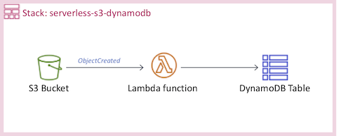

# Create a Serverless project

Work inside your AWS Cloud9 environment.



## Configure local environment

Configure Confirm that you are using the local credentials, and set the region name to **`us-east-1`** and the output format to **`json`**. 

``` bash
aws configure
```

## Install dependencies

``` bash
npm install -g serverless
```

## Create a Serverless project

``` bash
serverless create --template aws-python --path serverless-s3-dynamodb
cd serverless-s3-dynamodb
```

Replace your **handler.py** with the file [handler.py](handler.py).

Replace your **serverless.yml** with the file [serverless.yml](serverless.yml), change the **bucketName** with your own alias name.

## Deploy your Serverless project

``` bash
serverless deploy
```

## Testing

Upload files to your S3 bucket and explore your DynamoDB table.
